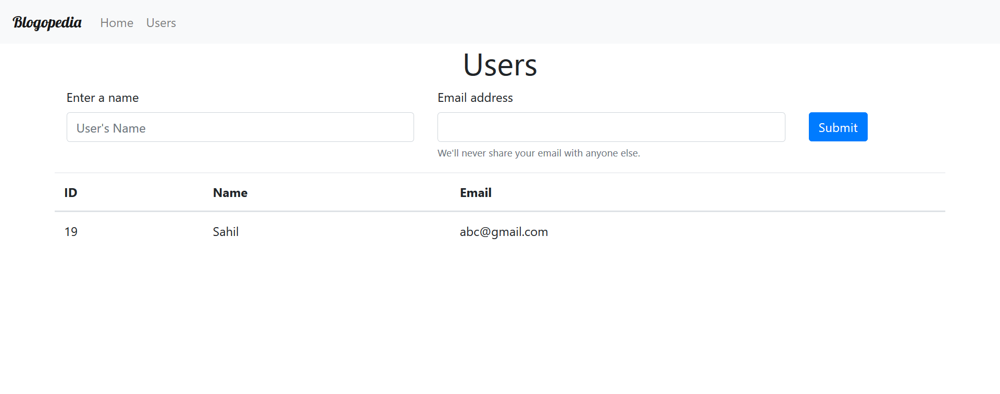

# Blogepedia
## An app for authors to publish blogs.

Blogepedia is a fully funtional Blog WebApp where you can easily write
and read articles. 
This web app has different categories of topics from which you can choose 
your interest.

Adding article is very easy you just has to choose your interest in which you wanna write and easily add article but for adding an article you should be a user first. So for writing an article you should be a user so you have to go on user page add create ypur user account after that you can read and write article of your choice.

## Here are some shots of WebApp :-
### Landing Page


### Add Article Page


### Add User Page


## Frontend 
The project is made on handle bars so hbs has to bes installed by commands given in running the project section.

## Backend 
Backend of the project is made on node so you should have installed node on your system. It can be run on version above 8.0.

## Running The Project
First of all clone the repositery locally on the system
then run further commands<br/>

To make db you should have installed mysql on the sysytem as databse base is on mysql
then run further commands on powershell of mysql.
```
create database blogdb;
create user bloguser identified by'blogs';
grant all privileges on blogdb.* to bloguser;
flush privileges;

```
Now for running project follow these steps:-
```
cd Project Directory
npm install
npm start
```
The project will start running at port http://localhost:9988 

## Dev Dependecies
handleBars(hbs) - Frontend <br/>
Node - Backend <br/>
Express - Backend
Node
