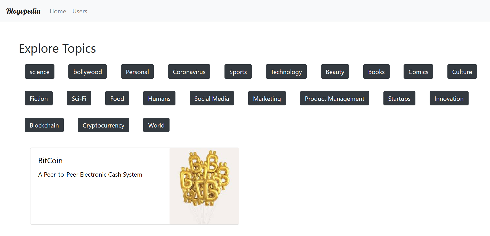
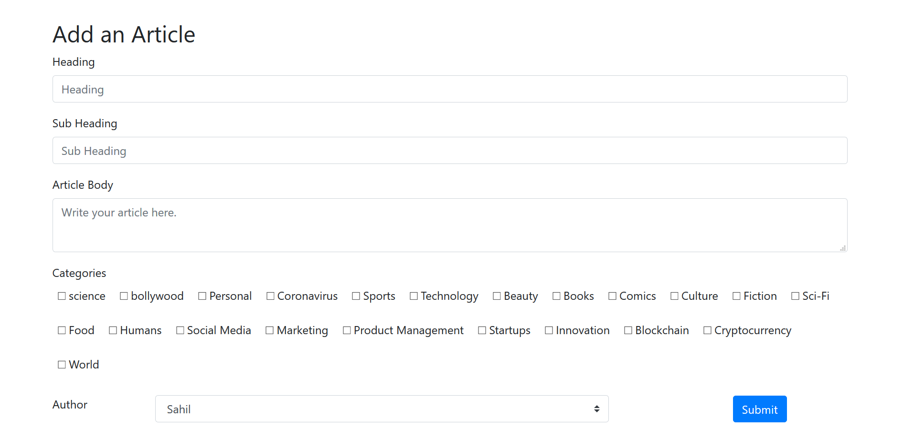

# Blogepedia
## An app for authors to publish blogs.

Blogepedia is a fully funtional Blog WebApp where you can easily write
and read articles. 
This web app has different categories of topics from which you can choose 
your interest.

Adding article is very easy you just has to choose your interest in which you wanna write and easily add article but for adding an article you should be a user first. So for writing an article you should be a user so you have to go on user page add create ypur user account after that you can read and write article of your choice 

## here are some shots of WebApp :-
### Landing Page

### Add Article page

### Add User Page

